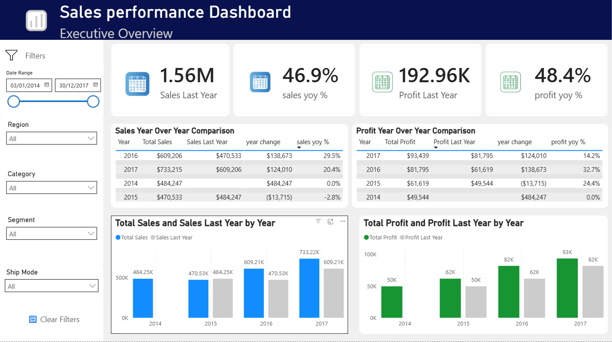

# 📊 Executive Sales Dashboard (Power BI + DAX)

## 📌 Overview

This project simulates an executive-level sales reporting environment using Power BI and DAX. The dashboard was designed to transform raw business data into actionable insights focused on sales performance, profitability, and year-over-year growth analysis.

The project emphasizes KPI reporting, time intelligence, and business storytelling to support data-driven decision-making.

---

## 🎯 Business Objectives

* Analyze overall sales and profit performance
* Compare current performance against previous years
* Track year-over-year (YoY) sales and profit growth
* Identify top-performing categories and regions
* Evaluate profitability trends across the business
* Support executive-level reporting and strategic analysis

---

## 🛠️ Tools & Technologies

* Power BI – Dashboard design and visualization
* DAX – KPI calculations and time intelligence
* Data Modeling – Relationships and Date Table creation

---

## 📊 Key KPIs

* Total Sales → Overall company revenue
* Total Profit → Overall company profitability
* Total Quantity → Total units sold
* Profit Margin % → Profitability relative to sales
* Sales YoY % → Year-over-year sales growth
* Profit YoY % → Year-over-year profit growth

---

## 🧠 DAX Concepts Used

* CALCULATE()
* SAMEPERIODLASTYEAR()
* DIVIDE()
* SUM()
* YEAR()
* MONTH()
* FORMAT()
* Date Table creation using CALENDAR()

---

## 📈 Dashboard Features

* Executive KPI cards for quick business performance overview
* Sales and profit trend analysis over time
* Year-over-year (YoY) comparison tables
* Regional sales analysis
* Category profitability analysis
* Customer performance analysis
* Interactive slicers and filtering
* Dedicated Time Intelligence reporting page

---

## 🖼️ Dashboard Preview – Executive Overview

---

## 🖼️ Dashboard Preview – Time Intelligence

---

## 📊 Key Business Insights

* Sales and profit both demonstrated overall growth across the reporting period
* Technology and Office Supplies generated stronger profitability compared to Furniture
* Certain regions consistently contributed a larger share of total sales
* Year-over-year analysis revealed periods of accelerated growth and slower performance
* Comparing sales against profit highlighted the importance of evaluating profitability rather than revenue alone

---

## 💼 Business Recommendations

* Focus growth strategies on high-performing categories with strong profit margins
* Investigate lower-profit categories to identify operational inefficiencies
* Continue monitoring YoY performance trends to support forecasting and planning
* Use regional performance insights to guide resource allocation and marketing efforts

---

## 🧩 Business Use Case

This dashboard can support business stakeholders by helping them:

* Monitor executive-level sales performance
* Evaluate profitability trends over time
* Compare current performance against historical periods
* Identify key revenue and profit drivers
* Support strategic business decision-making

---

## 🧠 Key Skills Demonstrated

* Built executive-level KPI dashboards in Power BI
* Developed DAX measures for time intelligence and YoY analysis
* Created and utilized a Date Table for chronological reporting
* Applied business storytelling through dashboard design
* Designed interactive reports using slicers and filtering
* Analyzed profitability and performance trends across multiple dimensions

---

## ✅ Data Validation

All KPI measures and YoY calculations were validated within Power BI to ensure consistency and accuracy across dashboard visuals and reporting tables.

---

## 🚀 Future Improvements

* Add rolling average and moving trend calculations
* Implement dynamic Top N analysis
* Introduce conditional KPI formatting and indicators
* Expand time intelligence with quarterly and monthly trend analysis
* Add forecasting visuals and predictive insights

---

## 👤 Author

Ernesto Villa  
Aspiring Data Analyst focused on SQL, Power BI, DAX, and business-driven analytic
